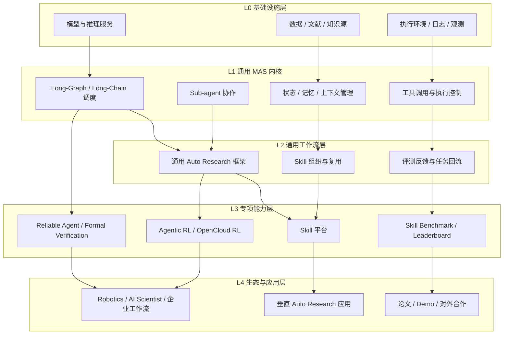
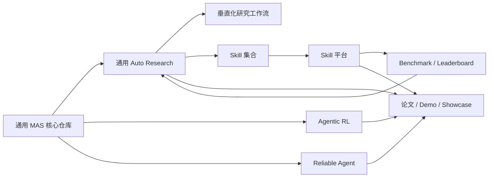
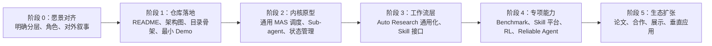

# Open Agent Ecosystem（中文草案）

> 基于 `会议记录.txt` 整理的中文 README 初稿。
> 当前版本用于快速对齐项目愿景、分层架构、子项目关系与推进路线，不代表代码现状。

## 1. 项目定位

这是一个面向 OpenCloud 时代的开源 Agent 生态项目。

它的目标不是只做一个单点产品，而是搭建一个能够持续承载不同 Agent 方向项目的公共底座，包括：

- 一个极简、通用、可扩展的多智能体系统（MAS）框架
- 一个可落地的 Auto Research 通用工作流框架
- 一个可复用、可评测、可流通的 Skill 体系
- 围绕 Agentic RL、可靠性验证等方向的专项研究模块
- 一套能够连接论文、开源项目、评测体系和实际应用的协作生态

## 2. 项目愿景

我们希望把这个项目做成一个“大生态 + 多项目 + 公共底座”的开源体系：

1. 底层是一套通用 Agent 框架，解决长链路、长上下文、多角色协作的问题。
2. 中层是工作流与 Skill 层，把 Auto Research、技能复用、评测闭环真正接起来。
3. 上层是多个有明确目标的项目，包括 Auto Research、Benchmark、Skill 平台、Agentic RL、Reliable Agent 等。
4. 最外层是论文、Demo、合作、落地应用与社区影响力。

换句话说，这不是“一个仓库”，而是一套能不断长出新项目的开源母体。

## 3. 为什么要做

当前 Agent 相关工作通常存在几个断层：

- 框架很多，但缺少一个足够简洁、通用、能承载后续项目的公共抽象
- Workflow、Skill、Benchmark、应用之间往往是分离的，难以形成正反馈
- 很多项目只能展示单次效果，难以沉淀为可复用资产
- 学术成果、开源代码和真实价值之间缺少统一的评价与连接方式

这个项目希望把这些割裂的部分重新组织起来，形成一个持续演化的 Agent 开源生态。

## 4. 总体分层

下面这套分层是根据会议纪要做的工程化归纳，用来指导仓库与项目组织。

| 层级 | 名称 | 职责 |
| --- | --- | --- |
| L4 | 生态与应用层 | 论文、Demo、合作项目、垂直应用、对外展示 |
| L3 | 专项能力层 | Skill 平台、Benchmark、Agentic RL、Reliable Agent 等专项方向 |
| L2 | 通用工作流层 | Auto Research 框架、Skill 编排、任务回流、评测闭环 |
| L1 | 通用 MAS 内核 | Long-Graph / Long-Chain、多 Agent 协作、状态管理、工具调度 |
| L0 | 基础设施层 | 模型服务、数据源、执行环境、日志与观测体系 |

## 5. Mermaid 框架图

### 5.1 整体分层架构图



### 5.2 子项目关系图



### 5.3 推进路线图



## 6. 核心模块说明

### 6.1 通用 MAS 内核

这是整个生态的最底层抽象，目标不是做成“功能最多”的框架，而是做成“足够简洁、结构合理、便于衍生”的核心骨架。

重点能力包括：

- 多 Agent 任务拆解与协作
- Long-Graph / Long-Chain 式任务编排
- 上下文、状态、记忆管理
- 工具调用、执行控制与结果回流
- 对上层工作流与专项项目提供统一接口

### 6.2 通用 Auto Research 框架

这是从通用内核之上长出来的第一类核心应用框架，用于支撑自动化研究任务，包括但不限于：

- 文献搜集
- 问题分解
- 假设生成
- 实验与评估
- 结果写作与复盘

这个层级应该尽量保持“通用”，而不是过早写死为某个特定学科或特定工作流。

### 6.3 垂直化研究工作流

当通用 Auto Research 框架稳定后，可以进一步向下沉淀为垂直版本，例如：

- 某个特定学科的自动研究工作流
- 某类论文生成与迭代流程
- 某种高度结构化的实验任务

这一层强调“高完成度”和“端到端效果”，是后续论文与展示的重要来源。

### 6.4 Skill 平台与 Skill 体系

Skill 是生态中最重要的可复用资产之一。

这一块的目标不是单纯存一堆 Prompt，而是形成一个闭环：

- Skill 的定义与封装
- Skill 的注册与管理
- Skill 的调用与组合
- Skill 的评测与排行榜
- Skill 的流通、共享和贡献机制

Auto Research 与 Skill 体系之间需要打通，避免技能资产与工作流资产分裂。

### 6.5 Benchmark / Leaderboard

Benchmark 负责提供一个相对统一的黄金标准，用于回答两个问题：

- 某个 Skill 或工作流到底有没有价值
- 不同 Skill / Agent 方案之间如何进行可比较的评估

它既是研究评价体系的一部分，也是平台生态的核心支点。

### 6.6 Agentic RL 与 Reliable Agent

这两个方向适合作为专项能力模块独立推进，再接回主生态。

- Agentic RL：负责把训练、反馈、策略优化等能力接进 Agent 体系
- Reliable Agent：负责形式化验证、可靠性增强、系统级稳健性

这类模块不必从第一天就高度耦合进主框架，但需要在接口层预留接入位。

## 7. 建议的协作分工

从会议纪要看，比较合理的组织方式不是“所有人做同一个仓库”，而是“统一叙事下的分模块协作”。

| 方向 | 建议职责 |
| --- | --- |
| 核心架构负责人 | 负责通用 MAS 内核、架构边界、接口定义 |
| 工作流负责人 | 负责 Auto Research 通用层与垂直流程沉淀 |
| Skill 负责人 | 负责 Skill 规范、Skill 集合、Skill 平台对接 |
| Benchmark 负责人 | 负责评测标准、排行榜、指标设计 |
| 专项研究负责人 | 负责 Agentic RL、Reliable Agent 等独立方向 |
| 生态协同负责人 | 负责合作方、论文、讲稿、对外展示与社区联动 |

协作原则建议如下：

- 底座仓库尽量稳定、简洁，少做强耦合
- 子项目可以独立推进，但要在接口与叙事上归一
- 各模块都应有明确 owner，避免“中间层没人负责”
- 先把可展示的版本搭起来，再逐步增强技术深度

## 8. 当前最值得优先落地的事情

结合会议纪要，近期最优先的不是一次性把所有功能做完，而是先把“这是什么”讲清楚，并能拿出一个最小可展示版本。

优先级建议：

1. 先搭一个通用 MAS 项目的仓库骨架和 README
2. 画清楚分层架构图、子项目关系图和路线图
3. 补一个最小原型，证明多 Agent / Long-Graph 抽象是成立的
4. 明确 Auto Research 在整个体系中的层级位置
5. 预留 Skill、Benchmark、RL、Reliable Agent 的接入接口

## 9. 近期里程碑建议

### 第 1 阶段：对齐与展示

- 产出中文 README
- 产出架构图和对外介绍页
- 形成统一项目命名和对外说法
- 搭出最小仓库结构

### 第 2 阶段：核心原型

- 实现通用 MAS 最小内核
- 支持基础任务拆解与 Sub-agent 协作
- 建立状态、工具、结果回流机制

### 第 3 阶段：工作流接入

- 将 Auto Research 抽象为通用工作流
- 接入 Skill 定义与调用接口
- 打通基础评测闭环

### 第 4 阶段：专项项目并入

- 接入 Benchmark / Leaderboard
- 接入 Skill 平台
- 吸纳 Agentic RL、Reliable Agent 等专项模块

### 第 5 阶段：生态放大

- 沉淀论文、Demo、报告与公开展示
- 引入更多合作方与贡献者
- 形成可持续演化的项目矩阵

## 10. 建议的仓库结构

如果这个仓库准备继续演化，可以先按下面的方式组织：

```text
.
├── README.md
├── docs/
│   ├── vision.md
│   ├── architecture.md
│   └── diagrams/
├── core/
│   ├── orchestration/
│   ├── memory/
│   ├── tools/
│   └── runtime/
├── workflows/
│   └── auto-research/
├── skills/
├── benchmark/
├── projects/
│   ├── agentic-rl/
│   └── reliable-agent/
└── demos/
```

## 11. 一句话总结

这个项目的核心不是“再做一个 Agent 框架”，而是搭一个能持续生长出框架、工作流、技能平台、评测体系和应用项目的开源 Agent 生态。
