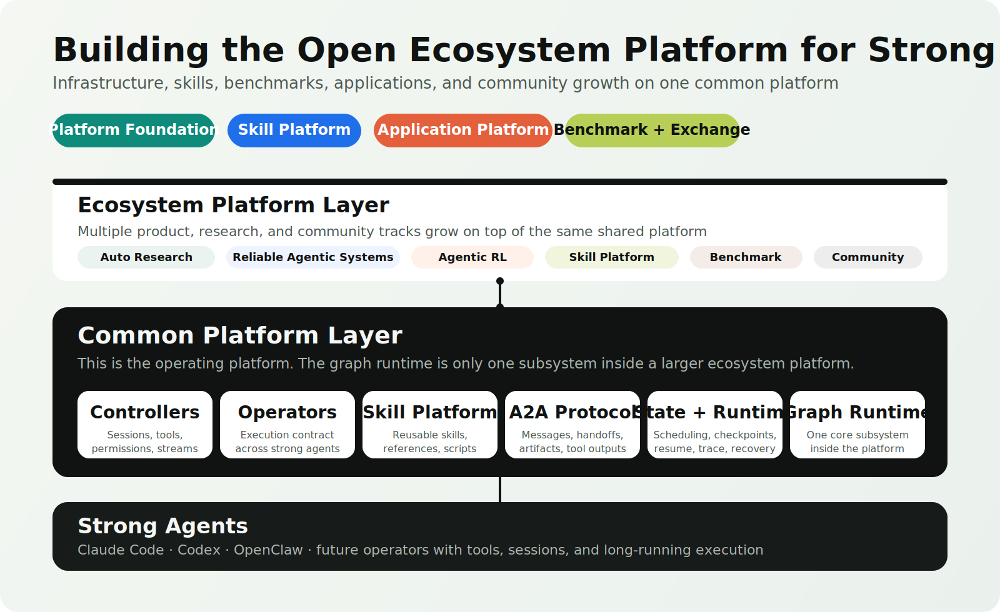
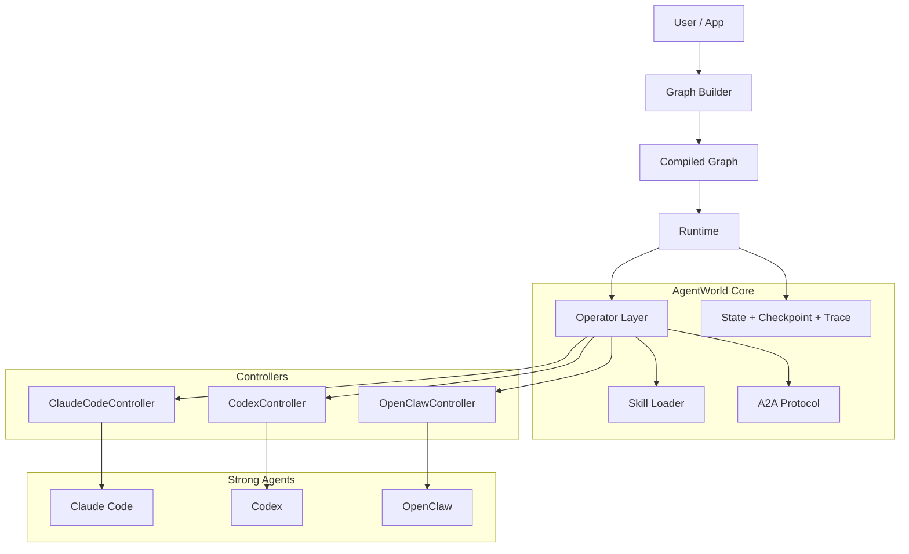

<a id="top"></a>

<div align="center">
  <h1>AgentWorld</h1>
</div>

<div align="center">

[](https://scienceintelligence.github.io/AgentWorld/)
[](https://github.com/ScienceIntelligence/AgentWorld)
[](https://github.com/ScienceIntelligence/AgentWorld/actions/workflows/ci.yml)
[](https://www.python.org/)
[](#-skill-marketplace)
[](#-supported-operators)
[](https://github.com/ScienceIntelligence/AgentWorld)

**A Python package for building filesystem-native strong-agent workflows and organizations**

[Quick Start](#quick-start) | [Usage](#usage) | [Auto-Research](#auto-research-use-case) | [AutoR Parity](docs/autor-parity.md) | [Skill Marketplace](#skill-marketplace) | [How It Works](#how-it-works) | [Supported Operators](#supported-operators) | [Examples](#examples) | [Roadmap](#roadmap)

</div>

<p align="center">
  
</p>

---

AgentWorld is a lower-level Python package for building **filesystem-native strong-agent workflows and organizations**.

It is designed to sit below concrete applications such as AutoR-style automated research systems. Those applications can define their own research stages, approval policies, artifact rules, and UI surfaces while AgentWorld provides reusable primitives for controllers, operators, workspaces, stages, artifacts, approval gates, skills, and graph execution.

This repository currently implements the foundation layer:

- provider-specific control through **controllers**
- uniform upper-layer execution through **operators**
- structured inter-agent communication through an explicit **A2A protocol**
- scheduling, checkpointing, and replay through a **graph runtime**
- reusable domain guidance through a repo-local **skill marketplace**
- durable run directories through **workspace primitives**
- fixed-stage workflow support through **stage contracts**
- run state, rollback, and resume through **manifest primitives**
- artifact validation and schema inference through **artifact primitives**
- hypothesis, experiment, and evidence ledgers through **research primitives**
- human or automated review through **approval gates**

In other words, the graph runtime is one important subsystem, but AgentWorld is broader than graph execution alone. It is the package layer that can be used to build systems such as AutoR, benchmark workflows, research organizations, and future strong-agent applications.

## Overview

### ✨ Highlights

<table>
<tr>
<td align="center" width="25%">🌐<br/><b>Open Platform Direction</b><br/><sub>A broader ecosystem vision spanning infrastructure, skills, benchmarks, applications, and community growth</sub></td>
<td align="center" width="25%">🏗️<br/><b>Platform Foundation</b><br/><sub>This repository currently focuses on the controller, operator, protocol, runtime, and graph foundation layer</sub></td>
<td align="center" width="25%">🧩<br/><b>Skill Platform Seed</b><br/><sub>Skills can already be packaged and loaded per node, forming the base of a larger skill platform</sub></td>
<td align="center" width="25%">📦<br/><b>Recoverable Runtime</b><br/><sub>Checkpoints, traceability, artifacts, and resumable execution are treated as core runtime concerns</sub></td>
</tr>
<tr>
<td align="center">🔌<br/><b>Controller Boundary</b><br/><sub>Provider-specific session lifecycle, tool policy, and stream parsing stay isolated</sub></td>
<td align="center">📨<br/><b>Explicit A2A</b><br/><sub>Messages, tool results, handoffs, and artifacts are structured instead of prompt glue</sub></td>
<td align="center">🕸️<br/><b>Graph Runtime Slice</b><br/><sub>The graph layer is currently the most concrete orchestration subsystem, not the entire platform definition</sub></td>
<td align="center">🧪<br/><b>Real Smoke Path</b><br/><sub>Claude Code already runs through the runtime in a real graph-backed case with CI-backed repository tests</sub></td>
</tr>
</table>

### 💡 Why AgentWorld

Most older agent frameworks focus on what a model can call.

This platform direction starts from what a strong agent can actually **run**:

- a real session
- a working directory
- a permission model
- tool calls with side effects
- long-running stateful execution
- collaboration with other agents in the same system

That changes the architecture:

- a controller is not optional glue, it is the provider boundary
- an operator is not just a prompt wrapper, it is a durable execution unit
- a skill is not a marketing label, it is reusable execution guidance attached to an operator
- a graph runtime is necessary, but it must live inside a broader platform that also supports skills, benchmarks, applications, and ecosystem growth
- the runtime must own checkpoint, resume, interrupt, trace, and artifact flow

### 🧭 Platform Scope

| Layer | Role | Status in this repository |
| --- | --- | --- |
| **Platform Foundation** | controllers, operators, protocol, runtime, workspace, manifest, stage, artifacts, graph execution | **Current implementation focus** |
| **Skill Platform** | reusable skill packaging, loading, references, scripts, future exchange | **Early implementation** |
| **Benchmark + Evaluation** | benchmark tasks, scorecards, leaderboards, comparisons | **Planned** |
| **Application Platform** | auto-research, reliable agentic systems, agentic RL, domain workflows | **Auto-research use case available** |
| **Ecosystem Layer** | community contribution, collaboration, future marketplace dynamics | **Vision / planned** |

### 🆕 News

- **2026-04-23** Added AutoR-class auto-research primitives: run manifests, stage repair, handoffs, approved memory, artifact schema inference, hypothesis manifests, and experiment manifests.
- **2026-04-23** Moved the public repository to `ScienceIntelligence/AgentWorld`.
- **2026-04-13** Added a dedicated `skills/` marketplace with research-oriented skills for paper search, literature synthesis, citation audit, experiment planning, and result audit.
- **2026-04-13** Added explicit per-node `skills` support so each operator node can receive a different skill set through the runtime.
- **2026-04-13** Published the GitHub Pages site under `docs/` and split the long architecture note into a dedicated design document.
- **2026-04-13** Refined the public repository surface so README and site stay English-first while private notes remain local and ignored.

<a id="quick-start"></a>
## 🚀 Quick Start

Clone and install the package in editable mode:

```bash
git clone https://github.com/ScienceIntelligence/AgentWorld.git
cd AgentWorld
python -m pip install -e .
```

Run the test suite:

```bash
python -m unittest discover -s tests -v
```

Run the deterministic planner / coder / reviewer graph:

```bash
python examples/planner_coder_reviewer.py
```

Inspect the AutoR-style workflow CLI:

```bash
python examples/auto-research/run.py --help
```

Useful options:

```bash
python examples/auto-research/run.py --approval-mode validation-only "..."
python examples/auto-research/run.py --resume-run /tmp/agentworld-auto-research-runs/<run-id> --approval-mode validation-only
python examples/auto-research/run.py --quiet "..."
python examples/auto-research/run.py --timeout 7200 --max-attempts 2 "..."
```

Run a complete AutoR-style workflow with the real Claude Code controller:

```bash
python - <<'PY'
import importlib.util

for package in ["sklearn", "numpy", "matplotlib"]:
    if importlib.util.find_spec(package) is None:
        raise SystemExit(f"Missing required package: {package}")
print("Python dependencies are available.")
PY

claude --version
```

```bash
python examples/auto-research/run.py \
  --runs-dir /tmp/agentworld-auto-research-runs \
  --approval-mode validation-only \
  --permission-mode bypassPermissions \
  --max-attempts 2 \
  --timeout 7200 \
  "Build and evaluate a handwritten digit classification model on the scikit-learn digits dataset. Train SVM-RBF, RandomForest, kNN, LogisticRegression, and DecisionTree baselines. The experiment stage must actually execute the Python training script and produce real cross-validation results, held-out test results, confusion matrices, hypothesis verdicts, figures, and a paper-style report. Do not use predicted or literature-only results as a substitute for execution."
```

This example uses the real Claude Code controller by default and requires a working authenticated `claude` CLI. The CLI prints live run, stage, Claude session, tool, validation, repair, and review progress. Use `--quiet` if you only want the final JSON result.

`bypassPermissions` is used here because the experimentation stage must run Python training code. Safer edit-only modes can allow file creation but block `python workspace/code/implementation.py`, producing an invalid run where the report is based on predictions rather than executed results.

After the run finishes, validate the produced artifacts:

```bash
RUN_ROOT="$(ls -td /tmp/agentworld-auto-research-runs/* | head -1)"

python - <<PY
import json
from pathlib import Path

root = Path("$RUN_ROOT")
manifest = json.loads((root / "run_manifest.json").read_text())
results = json.loads((root / "workspace/results/results.json").read_text())

required = [
    "workspace/results/results.json",
    "workspace/results/cv_results.json",
    "workspace/results/test_results.json",
    "workspace/results/ablation_results.json",
    "workspace/results/hypothesis_verdicts.json",
    "workspace/results/confusion_matrices.npz",
    "workspace/results/experiment_manifest.json",
    "workspace/figures/accuracy_comparison.png",
    "workspace/figures/confusion_matrices.png",
    "workspace/figures/summary.svg",
    "workspace/writing/main.tex",
    "workspace/writing/references.bib",
    "workspace/artifacts/paper.pdf",
    "workspace/artifacts/build_log.txt",
    "workspace/artifacts/citation_verification.json",
    "workspace/artifacts/self_review.json",
]

missing = [path for path in required if not (root / path).exists()]
approved = sum(1 for stage in manifest["stages"] if stage["approved"])
blocked = bool(results.get("execution_blocker")) or results.get("experiments_executed") is False
exit_code = results.get("exit_code")

print("run_root:", root)
print("run_status:", manifest["run_status"])
print("approved:", approved, "/", len(manifest["stages"]))
print("exit_code:", exit_code)
print("missing:", missing or "none")

if manifest["run_status"] != "completed":
    raise SystemExit("Run did not complete.")
if approved != len(manifest["stages"]):
    raise SystemExit("Not all stages were approved.")
if blocked:
    raise SystemExit("Experiment execution was blocked.")
if exit_code not in (0, None):
    raise SystemExit(f"Experiment script failed with exit_code={exit_code}.")
if missing:
    raise SystemExit("Required artifacts are missing.")

cv = results.get("cv_results", {})
print("cv_accuracy:")
for model, payload in cv.items():
    if isinstance(payload, dict) and "mean_cv_accuracy" in payload:
        print(f"  {model}: {payload['mean_cv_accuracy']:.4f}")
PY
```

Expected checks:

- `run_status` is `completed`
- every stage is approved
- `workspace/results/results.json` records `exit_code: 0` or equivalent successful execution metadata
- no `execution_blocker` is present
- result JSON files, confusion matrices, figures, manuscript source, PDF, citation verification, and self-review artifacts exist

Run the real Claude Code smoke graph:

```bash
python examples/claude_real_smoke.py
```

The Claude smoke case requires a working local `claude` CLI and an authenticated environment.

<a id="usage"></a>
## Usage

### Create A Durable Run Workspace

```python
from pathlib import Path

from agentworld import create_run_workspace

workspace = create_run_workspace(
    runs_dir=Path("runs"),
    run_id="my-run",
    goal="Evaluate a recoverable multi-agent research workflow.",
    config={"workflow": "custom-research"},
)

print(workspace.run_root)
print(workspace.memory)
print(workspace.artifact_index)
```

This creates a filesystem-native run layout with `goal.md`, `memory.md`, `run_config.json`, `run_manifest.json`, `artifact_index.json`, `prompt_cache/`, `operator_state/`, `stages/`, `handoffs/`, and `workspace/`.

### Run Auto-Research From Python

```python
from pathlib import Path

from agentworld import run_auto_research

result = run_auto_research(
    goal=(
        "Build and evaluate a handwritten digit classification model on the "
        "scikit-learn digits dataset. Train at least two classical machine "
        "learning baselines, compare their accuracy and confusion matrices, "
        "save reusable Python code, produce one summary figure, and write a "
        "concise research-style report."
    ),
    runs_dir=Path("runs"),
    approval_mode="validation-only",
    permission_mode="bypassPermissions",
)

print(result.success)
print(result.workspace.run_root)
print(result.approved_stages)
```

This path uses `ClaudeCodeController` through `ControllerStageOperator`. It requires an authenticated local Claude Code CLI.

For non-interactive validation gates:

```python
result = run_auto_research(
    goal="Build a compact handwritten digit classifier evaluation report on the scikit-learn digits dataset.",
    runs_dir=Path("runs"),
    approval_mode="validation-only",
)
```

`validation-only` still uses the real controller. It only replaces the manual approval prompt with validation-based approval.

For experiment-heavy workflows, use a permission mode that allows the strong agent to execute local commands inside the run workspace. If command execution is blocked, AgentWorld validation rejects result files that explicitly report blocked, skipped, or unexecuted experiments.

### Build A Skill-Aware Graph

```python
from agentworld import AgentGraph, DefaultOperator, StaticController
from agentworld.controller.base import ControllerEvent


def planner_script(_request):
    return [
        ControllerEvent(kind="message_completed", payload={"text": "Plan ready."}),
        ControllerEvent(kind="completed", payload={"state_patch": {"planned": True}}),
    ]


graph = AgentGraph(name="skill-aware-graph")
graph.add_operator("planner", DefaultOperator("planner", StaticController(planner_script)))
graph.add_node(
    "plan",
    operator="planner",
    objective="Plan the study",
    skills=["research-paper-search", "literature-synthesis"],
)

result = graph.compile().invoke({"task": "prepare a research plan"})
print(result.state)
```

Each node can receive a different skill list. The runtime injects those skills into the operator request without changing provider-level configuration.

<a id="auto-research-use-case"></a>
## Auto-Research as a Use Case

AutoR is a concrete human-centered research application. AgentWorld is positioned one layer below it.

An AutoR-style system needs:

- a durable run directory
- a fixed research-stage pipeline
- stage draft and final files
- approved cross-stage memory
- human or automated approval gates
- artifact validation
- operator session state
- recovery and resume semantics

AgentWorld now exposes the reusable primitives needed for that layer:

| Auto-research need | AgentWorld primitive |
| --- | --- |
| run directory | `RunWorkspace` |
| run manifest | `RunManifest` / `StageManifestEntry` |
| stage contract | `StageSpec` |
| stage execution | `StageOperator` / `StageRunRequest` / `StageRunResult` / `StageRepairRequest` |
| artifact requirements | `ArtifactRequirement` |
| artifact index + schema inference | `scan_artifacts` / `write_artifact_index` |
| hypothesis manifest | `write_hypothesis_manifest` |
| experiment manifest | `write_experiment_manifest` |
| approved memory + handoff | `append_approved_stage_summary` / `write_stage_handoff` |
| rollback + resume | `rollback_to_stage` / `AutoResearchWorkflow.resume(...)` |
| approval boundary | `ApprovalGate` |
| packaged workflow | `AutoResearchWorkflow` |
| application factory | `run_auto_research` / `create_auto_research_app` |

The reference example lives in [`examples/auto-research`](examples/auto-research). It does not vendor or modify AutoR. It demonstrates that an AutoR-like eight-stage research workflow can be expressed clearly on top of AgentWorld.

The parity breakdown is documented in [`docs/autor-parity.md`](docs/autor-parity.md).

### Auto-Research Run Layout

An auto-research run writes durable state to a run root:

```text
run_root/
├── goal.md
├── user_input.txt
├── memory.md
├── run_config.json
├── run_manifest.json
├── artifact_index.json
├── logs.txt
├── events.jsonl
├── logs_raw/
├── prompt_cache/
├── operator_state/
├── stages/
├── handoffs/
└── workspace/
    ├── literature/
    ├── code/
    ├── data/
    ├── results/
    ├── figures/
    ├── writing/
    ├── notes/
    ├── reviews/
    ├── artifacts/
    ├── bootstrap/
    └── profile/
```

The important files are intentionally plain files. Strong agents can inspect and update the workspace directly, while AgentWorld maintains the stage manifest, artifact index, approved memory, and handoffs.

### Complete Auto-Research Case

The recommended smoke case is a small, fully executable scientific workflow:

1. build a literature-backed plan for the scikit-learn digits dataset
2. generate typed hypotheses
3. design the study
4. write reusable training code
5. execute the experiment
6. analyze measured results
7. write a paper-style report
8. prepare release artifacts

Run it with Claude Code:

```bash
python examples/auto-research/run.py \
  --runs-dir /tmp/agentworld-auto-research-runs \
  --approval-mode validation-only \
  --permission-mode bypassPermissions \
  --max-attempts 2 \
  --timeout 7200 \
  "Build and evaluate a handwritten digit classification model on the scikit-learn digits dataset. Train SVM-RBF, RandomForest, kNN, LogisticRegression, and DecisionTree baselines. The experiment stage must actually execute the Python training script and produce real cross-validation results, held-out test results, confusion matrices, hypothesis verdicts, figures, and a paper-style report. Do not use predicted or literature-only results as a substitute for execution."
```

A valid completed run should include at least:

```text
workspace/results/results.json
workspace/results/cv_results.json
workspace/results/test_results.json
workspace/results/ablation_results.json
workspace/results/hypothesis_verdicts.json
workspace/results/confusion_matrices.npz
workspace/figures/accuracy_comparison.png
workspace/figures/confusion_matrices.png
workspace/figures/summary.svg
workspace/writing/main.tex
workspace/writing/references.bib
workspace/artifacts/paper.pdf
workspace/artifacts/build_log.txt
workspace/artifacts/citation_verification.json
workspace/artifacts/self_review.json
```

If a run fails or is interrupted, resume it from the run root:

```bash
python examples/auto-research/run.py \
  --resume-run /tmp/agentworld-auto-research-runs/<run-id> \
  --approval-mode validation-only \
  --permission-mode bypassPermissions \
  --max-attempts 2
```

Do not treat a run as successful just because `run_manifest.json` says `completed`. The experiment artifacts must also show successful execution, with no `execution_blocker` and no `experiments_executed=false` marker.

<a id="how-it-works"></a>
## ⚙️ How It Works

The diagram below describes the **current foundation layer implemented in this repository**. It is not intended to represent the entire future ecosystem platform.



### Current Foundation Execution Flow

1. Build a graph of operator-backed nodes
2. Assign objective, role, tool policy, and skills to each node
3. Compile the graph into a runtime
4. Let the runtime assemble a normalized operator request
5. Let the controller drive the real strong agent
6. Convert events into messages, artifacts, handoffs, and state patches
7. Merge state, route the next nodes, and persist traceable execution state

### Current Foundation Boundaries

| Boundary | Responsibility |
| --- | --- |
| Controller | provider-specific invocation, sessions, stream parsing, tool policy mapping |
| Operator | uniform request/result contract, prompt assembly, skill loading, normalized outputs |
| Skill | reusable domain guidance, references, scripts, and task-specific workflow instructions |
| A2A Protocol | messages, tool outputs, handoffs, artifact references |
| Runtime | scheduling, state merge, checkpoint, resume, interrupt, trace |

<a id="skill-marketplace"></a>
## 🧩 Skill Marketplace

AgentWorld treats skills as reusable execution modules that can be attached to individual operator nodes.

A skill is stored as a folder, usually with:

- `SKILL.md` for instructions and activation guidance
- optional `references/` for domain notes
- optional `scripts/` for repeatable local tooling
- optional `assets/` for templates or helper files

### Included Research Skills

| Skill | Purpose |
| --- | --- |
| `research-paper-search` | find papers, databases, identifiers, and evidence trails before execution |
| `literature-synthesis` | turn a paper set into claims, themes, contradictions, and gaps |
| `citation-audit` | validate references, metadata, citation hygiene, and bibliography consistency |
| `experiment-planning` | design executable research plans, deliverables, risks, and validation steps |
| `result-audit` | review outputs for unsupported claims, missing evidence, weak baselines, and incomplete analysis |

### Load Different Skills Per Operator

```python
from agentworld import AgentGraph, DefaultOperator

graph = AgentGraph(name="research-flow")
graph.add_operator("planner", planner_operator)
graph.add_operator("reviewer", reviewer_operator)

graph.add_node(
    "plan",
    operator="planner",
    objective="Search relevant work and plan the study",
    skills=["research-paper-search", "literature-synthesis", "experiment-planning"],
)

graph.add_node(
    "review",
    operator="reviewer",
    objective="Audit claims and evidence",
    skills=["citation-audit", "result-audit"],
)
```

The runtime injects the selected skill list into the operator request, so different nodes can run with different domain guidance even when they use the same underlying controller.

### Add Your Own Skill

Create a new folder under `skills/`:

```text
skills/
└── my-skill/
    └── SKILL.md
```

Minimal `SKILL.md` format:

```md
---
name: my-skill
description: What this skill should be used for.
---

# My Skill

## When to Use This Skill
- ...

## Workflow
- ...
```

<a id="supported-operators"></a>
## 🤖 Supported Operators

The current platform foundation is designed to schedule strong agents through provider-specific controllers:

| Operator | Current State | Notes |
| --- | --- | --- |
| **Claude Code** | Implemented | Real CLI-backed controller with stream parsing and smoke coverage |
| **Codex** | Scaffolded | Contract is present, runtime path still needs full implementation |
| **OpenClaw** | Scaffolded | Contract is present, controller behavior still needs full implementation |

<a id="examples"></a>
## 🧪 Examples

### Planner -> Coder -> Reviewer

[examples/planner_coder_reviewer.py](examples/planner_coder_reviewer.py)

Validates:

- sequential graph execution
- reducer-based state merging
- artifact creation
- message propagation
- per-node skill injection

### Real Claude Code Graph

[examples/claude_real_smoke.py](examples/claude_real_smoke.py)

Validates:

- real `ClaudeCodeController` command assembly
- real event parsing from Claude Code
- `tool_call` and `tool_result` normalization
- planner-to-reviewer graph handoff

### Real Claude Code Skill Graph

[examples/claude_skill_smoke.py](examples/claude_skill_smoke.py)

Validates:

- repo-local skill loading
- skill content injection into the operator instruction
- real Claude Code execution without persistent Claude configuration changes
- skill-aware output generation

### Auto-Research Workflow

[examples/auto-research](examples/auto-research)

Validates:

- real Claude Code backed stage execution
- durable run manifests and per-stage operator state
- stage draft, repair, review, and final promotion
- approved memory and stage handoffs
- artifact index, hypothesis manifest, and experiment manifest generation

## 📁 Repository Structure

```text
.
├── README.md
├── docs/
│   ├── index.html
│   ├── architecture.md
│   ├── auto-research-use-case.md
│   ├── autor-parity.md
│   └── assets/
├── examples/
│   ├── auto-research/
│   ├── claude_real_smoke.py
│   ├── claude_skill_smoke.py
│   └── planner_coder_reviewer.py
├── skills/
│   ├── README.md
│   ├── research-paper-search/
│   ├── literature-synthesis/
│   ├── citation-audit/
│   ├── experiment-planning/
│   └── result-audit/
├── src/agentworld/
│   ├── apps/
│   ├── approval/
│   ├── artifacts/
│   ├── controller/
│   ├── graph/
│   ├── manifest/
│   ├── operator/
│   ├── protocol/
│   ├── research/
│   ├── runtime/
│   ├── stage/
│   ├── workflows/
│   └── workspace/
└── tests/
```

## 📚 Documentation

- Official site: [scienceintelligence.github.io/AgentWorld](https://scienceintelligence.github.io/AgentWorld/)
- Architecture note: [docs/architecture.md](docs/architecture.md)
- Auto-research use case: [docs/auto-research-use-case.md](docs/auto-research-use-case.md)
- AutoR parity map: [docs/autor-parity.md](docs/autor-parity.md)
- Skill marketplace: [skills/README.md](skills/README.md)

<a id="roadmap"></a>
## 🗺️ Roadmap

- complete the Codex controller
- complete the OpenClaw controller
- harden checkpoint, resume, and trace persistence
- extend graph routing and handoff semantics
- grow the skill platform with richer loading, references, and reusable execution assets
- add benchmark and evaluation primitives for strong-agent workflows
- publish stronger application-layer examples for research and domain-specific multi-agent systems
- expand the public platform docs and ecosystem-facing site

---

## Community

### 🤝 Contributing

Contributions are especially useful around:

- controller implementations
- runtime behavior
- graph semantics
- skill design
- tests and examples
- documentation improvements

### 📬 Contact

Open an issue for bugs, design questions, controller support requests, or skill contributions.

### ⭐ Star History

<a href="https://www.star-history.com/#ScienceIntelligence/AgentWorld&Date">
  <picture>
    <source media="(prefers-color-scheme: dark)" srcset="https://api.star-history.com/svg?repos=ScienceIntelligence/AgentWorld&type=Date&theme=dark" />
    <source media="(prefers-color-scheme: light)" srcset="https://api.star-history.com/svg?repos=ScienceIntelligence/AgentWorld&type=Date" />
    
  </picture>
</a>

<p align="right"><a href="#top">🔝 Back to top</a></p>
